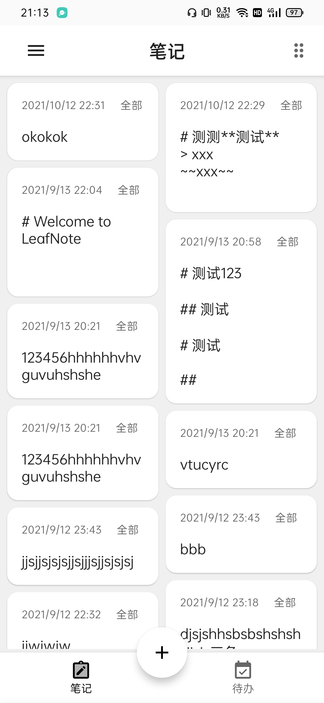
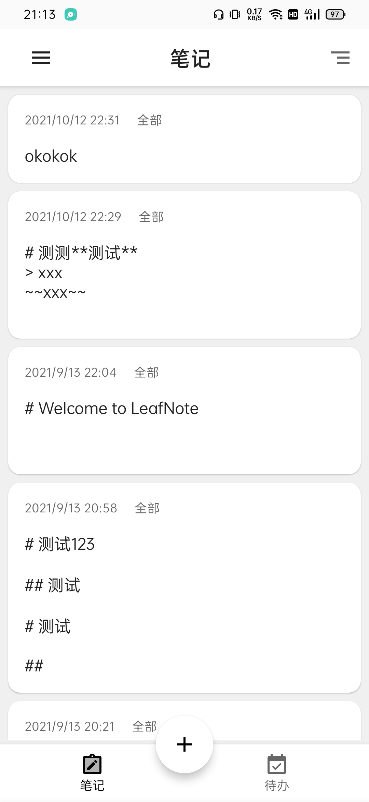

# ONote 羽记

> 本项目是本人的Android课程设计作业，可供学习参考

羽记是一个基于Jetpack Compose构建的，轻量级Markdown笔记应用，内部集成笔记分类管理，待办事项管理等功能。

## 基本功能

- 多笔记管理，笔记分类
- 基于Markdown的笔记编辑和查阅
- 待办事项管理

## 依赖技术

- Jetpack Compose
- Hilt
- Room
- Coil
- Markwon

## 应用截图

